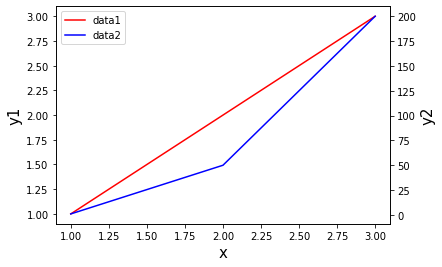

```python
git init
```


      File "/var/folders/y4/xk_ljn6n3jv3kr__4rx3cg9c0000gn/T/ipykernel_12902/2830201818.py", line 1
        git init
            ^
    SyntaxError: invalid syntax


```python
import matplotlib.pyplot as plt
```

# 여러 데이터를 한 차트에 그리기


```python
# 문제 : data1(x : 1, 2, 3; y : 1, 2, 3) 과 data2(x : 1, 2, 3; y : 1, 4, 7) 을 그래프로 출력하시오.
```


```python
x1 = [1, 2, 3]
y1 = [1, 2, 3]
x2 = [1, 2, 3]
y2 = [1, 4, 7]
```


```python
plt.plot(x1, y1, color = 'blue')
plt.plot(x2, y2, color = 'red')
```


    [<matplotlib.lines.Line2D at 0x7f84a4516ee0>]


    

    


```python
plt.plot(x1,y1,'b', x2,y2,'r')
```


    [<matplotlib.lines.Line2D at 0x7f84a464f100>,
     <matplotlib.lines.Line2D at 0x7f84a464f130>]


    

    


```python
plt.plot(x1, y1, color = 'blue', label='data1')  #범례추가
plt.plot(x2, y2, color = 'red', label ='data2')
plt.legend()
```


    <matplotlib.legend.Legend at 0x7f84a4776070>


    

    


```python
plt.plot(x1, y1, color = 'blue')
plt.plot(x2, y2, color = 'red')
plt.legend(['data1', 'data2'], loc = 'upper right', fontsize = 12)  #위치설정
```


    <matplotlib.legend.Legend at 0x7f84a4a3d730>


    

    


```python
#문제 : data1(x : 1, 2, 3; y : 1, 2, 3) 과 data2(x : 1, 2, 3; y : 1, 100, 200) 을 그래프로 출력하시오.
```


```python
x1 = [1, 2, 3]
y1 = [1, 2, 3]
x2 = [1, 2, 3]
y2 = [1, 100, 200]

plt.plot(x1, y1, color = 'blue')
plt.plot(x2, y2, color = 'red')
```


    [<matplotlib.lines.Line2D at 0x7f84a4b3bbe0>]


    

    


## subplot / subplots 를 이용한 여러개의 차트 그리기


```python
import matplotlib.pyplot as plt
```


```python
# 문제 : data1(x : 1, 2, 3; y : 1, 2, 3) 과 data2(x : 1, 2, 3; y : 1, 100, 200) 을 그래프로 출력하시오.
```


```python
x1 = [1, 2, 3]
y1 = [1, 2, 3]
x2 = [1, 2, 3]
y2 = [1, 100, 200]
```


```python
# subplot을 이용한 해결
# subplot(행의 수, 열의 수, 해당 그래프가 그려질 위치)
```


```python
plt.subplot(1,2,1)
plt.plot(x1, y1)
plt.title('data1')

plt.subplot(1,2,2)
plt.plot(x2, y2)
plt.title('data2')
```


    Text(0.5, 1.0, 'data2')


    

    


```python
plt.subplot(2, 1, 1)
plt.plot(x1, y1)
plt.title('data1')

plt.subplot(2, 1, 2)
plt.plot(x2, y2)
plt.title('data2')

plt.tight_layout() # tight_layout 을 이용하면 레이아웃이 자동으로 설정됨
```


    

    


```python
# subplots 를 이용한 해결

fig, axe1 = plt.subplots(nrows =1, ncols=2)
```


    

    


```python
axe1
```


    array([<AxesSubplot:>, <AxesSubplot:>], dtype=object)


```python
axe1[0].plot(x1,y1,color = 'blue')
fig
```


    

    


```python
axe1[1].plot(x2,y2, color = 'red')
fig
```


    

    


```python
#문제 : data1(x : 1, 2, 3; y : 1, 2, 3) 과 data2(x : 1, 2, 3; y : 1, 50, 200) 을 그래프로 출력하시오.# 
```


```python
x1 = [1, 2, 3]
y1 = [1, 2, 3]
x2 = [1, 2, 3]
y2 = [1, 50, 200]
```


```python
fig, axe1 = plt.subplots()
axe2 = axe1.twinx()
axe1.plot(x1, y1, color = 'red', label = 'data1')
axe2.plot(x2, y2, color = 'blue', label = 'data2')

axe1.set_xlabel('x', fontsize =15)
axe1.set_ylabel('y1', fontsize =15)
axe2.set_ylabel('y2', fontsize =15)
```


    Text(0, 0.5, 'y2')


    

    


```python
#y 축을 두 개 가진 차트에서 범례 표시하기
fig, axe1 = plt.subplots()

axe2 = axe1.twinx()
chart1 = axe1.plot(x1, y1, color = 'red')
chart2 = axe2.plot(x2, y2, color = 'blue')

axe1.set_xlabel('x', fontsize = 15)
axe1.set_ylabel('y1', fontsize = 15)
axe2.set_ylabel('y2', fontsize = 15)

chart = chart1 + chart2
axe1.legend(chart, ['data1', 'data2'])
```


    <matplotlib.legend.Legend at 0x7f84a4eb4190>


    

    


# load_dataset 을 이용한 데이터 셋 불러오기


```python
import matplotlib.pyplot as plt 
import seaborn as sns
import pandas as pd
```


```python
# 예제1 : iris

df = sns.load_dataset('iris')
df
```


<div>
<style scoped>
    .dataframe tbody tr th:only-of-type {
        vertical-align: middle;
    }

    .dataframe tbody tr th {
        vertical-align: top;
    }

    .dataframe thead th {
        text-align: right;
    }
</style>
<table border="1" class="dataframe">
  <thead>
    <tr style="text-align: right;">
      <th></th>
      <th>sepal_length</th>
      <th>sepal_width</th>
      <th>petal_length</th>
      <th>petal_width</th>
      <th>species</th>
    </tr>
  </thead>
  <tbody>
    <tr>
      <th>0</th>
      <td>5.1</td>
      <td>3.5</td>
      <td>1.4</td>
      <td>0.2</td>
      <td>setosa</td>
    </tr>
    <tr>
      <th>1</th>
      <td>4.9</td>
      <td>3.0</td>
      <td>1.4</td>
      <td>0.2</td>
      <td>setosa</td>
    </tr>
    <tr>
      <th>2</th>
      <td>4.7</td>
      <td>3.2</td>
      <td>1.3</td>
      <td>0.2</td>
      <td>setosa</td>
    </tr>
    <tr>
      <th>3</th>
      <td>4.6</td>
      <td>3.1</td>
      <td>1.5</td>
      <td>0.2</td>
      <td>setosa</td>
    </tr>
    <tr>
      <th>4</th>
      <td>5.0</td>
      <td>3.6</td>
      <td>1.4</td>
      <td>0.2</td>
      <td>setosa</td>
    </tr>
    <tr>
      <th>...</th>
      <td>...</td>
      <td>...</td>
      <td>...</td>
      <td>...</td>
      <td>...</td>
    </tr>
    <tr>
      <th>145</th>
      <td>6.7</td>
      <td>3.0</td>
      <td>5.2</td>
      <td>2.3</td>
      <td>virginica</td>
    </tr>
    <tr>
      <th>146</th>
      <td>6.3</td>
      <td>2.5</td>
      <td>5.0</td>
      <td>1.9</td>
      <td>virginica</td>
    </tr>
    <tr>
      <th>147</th>
      <td>6.5</td>
      <td>3.0</td>
      <td>5.2</td>
      <td>2.0</td>
      <td>virginica</td>
    </tr>
    <tr>
      <th>148</th>
      <td>6.2</td>
      <td>3.4</td>
      <td>5.4</td>
      <td>2.3</td>
      <td>virginica</td>
    </tr>
    <tr>
      <th>149</th>
      <td>5.9</td>
      <td>3.0</td>
      <td>5.1</td>
      <td>1.8</td>
      <td>virginica</td>
    </tr>
  </tbody>
</table>
<p>150 rows × 5 columns</p>
</div>


```python
# 문제 : iris 데이터 셋의 petal_length 와 petal_width 를 이용하여 산점도를 그리시오.

#mathplotlib

plt.scatter(df['petal_length'], df['petal_width'])
```


    <matplotlib.collections.PathCollection at 0x7f84a7b11730>


    

    


```python
#seaborn
sns.scatterplot(data=df, x='petal_length', y ='petal_width')
plt.title('iris')   #호환가능
```


    Text(0.5, 1.0, 'iris')


    

    


## barplot을 이용한 막대 그래프 그리기 


```python
import numpy as np
import matplotlib as mpl
import matplotlib.pyplot as plt

import seaborn as sns
import pandas as pd
```


```python
import matplotlib.pyplot as plt
plt.rc('font', family='NanumGothicTTF')
print(plt.rcParams['font.family'])
```

    ['NanumGothicTTF']


```python
plt.rcParams['font.family'] = 'AppleGothic' ####
```


```python
movie_title = ['크루엘라', '극장판 귀멸의 칼날', '학교 가는 길']
audience = [664308, 2099131, 20067]

data = {'영화제목' : movie_title, '누적관객' : audience}
df = pd.DataFrame(data)
```


```python
sns.barplot(data = df, x = '영화제목', y = '누적관객')
```


    <AxesSubplot:xlabel='영화제목', ylabel='누적관객'>


    

    


```python
#차트 크기 변경
sns.set(rc={'figure.figsize':(10,5)})
plt.rcParams['font.family'] = 'AppleGothic'
sns.barplot(data = df, x = '영화제목', y = '누적관객')
```


    <AxesSubplot:xlabel='영화제목', ylabel='누적관객'>


    

    


```python
#누적관객수 별로 그리기
sns.barplot(data = df, x = '영화제목', y='누적관객'
           , order = df.sort_values('누적관객').영화제목)
```


    <AxesSubplot:xlabel='영화제목', ylabel='누적관객'>


    

    


```python
#ascending 을 이용한 내림차순 정렬
sns.barplot(data = df, x = '영화제목', y = '누적관객',
             order = df.sort_values('누적관객', ascending = False).영화제목)
```


    <AxesSubplot:xlabel='영화제목', ylabel='누적관객'>


    

    


```python
#관객 수 포맷 변환
chart = sns.barplot(data = df, x = '영화제목', y = '누적관객',
             order = df.sort_values('누적관객', ascending = False).영화제목)
ylabels=['{:,.0f}'.format(i) + '만 명'for i in chart.get_yticks() / 10000]
chart.set_yticklabels(ylabels)
```

    /var/folders/y4/xk_ljn6n3jv3kr__4rx3cg9c0000gn/T/ipykernel_1415/3234868568.py:5: UserWarning: FixedFormatter should only be used together with FixedLocator
      chart.set_yticklabels(ylabels)


    [Text(0, 0.0, '0만 명'),
     Text(0, 250000.0, '25만 명'),
     Text(0, 500000.0, '50만 명'),
     Text(0, 750000.0, '75만 명'),
     Text(0, 1000000.0, '100만 명'),
     Text(0, 1250000.0, '125만 명'),
     Text(0, 1500000.0, '150만 명'),
     Text(0, 1750000.0, '175만 명'),
     Text(0, 2000000.0, '200만 명'),
     Text(0, 2250000.0, '225만 명')]


    

    


```python
#경고문 제외
import matplotlib.ticker as mticker

chart = sns.barplot(data = df, x = '영화제목', y = '누적관객',
             order = df.sort_values('누적관객', ascending = False).영화제목)

ticks_labels = chart.get_yticks().tolist()
chart.yaxis.set_major_locator(mticker.FixedLocator(ticks_labels))
chart.set_yticklabels(['{:,.0f}'.format(i / 10000) + '만 명' for i in ticks_labels])
```


    [Text(0, 0.0, '0만 명'),
     Text(0, 250000.0, '25만 명'),
     Text(0, 500000.0, '50만 명'),
     Text(0, 750000.0, '75만 명'),
     Text(0, 1000000.0, '100만 명'),
     Text(0, 1250000.0, '125만 명'),
     Text(0, 1500000.0, '150만 명'),
     Text(0, 1750000.0, '175만 명'),
     Text(0, 2000000.0, '200만 명'),
     Text(0, 2250000.0, '225만 명')]


    

    


```python
#가로로 그리기
chart = sns.barplot(data = df, x='누적관객', y = '영화제목'
                    , order = df.sort_values('누적관객', ascending =False).영화제목, color = 'blue' )
xlabels = ['{:,.0f}'.format(i) + '만 명' for i in chart.get_xticks() / 10000]
chart.set_xticklabels(xlabels)


plt.xlabel('누적관객', fontsize = 15)
plt.ylabel('영화제목', fontsize = 15)
plt.title('영화 별 누적관객수', fontsize = 20)  #제목 추가, 폰트 사이즈 변경
```

    /var/folders/y4/xk_ljn6n3jv3kr__4rx3cg9c0000gn/T/ipykernel_1415/2508819268.py:5: UserWarning: FixedFormatter should only be used together with FixedLocator
      chart.set_xticklabels(xlabels)


    Text(0.5, 1.0, '영화 별 누적관객수')


    

    


# countplot을 이용한 막대 그래프 그리기


```python
import matplotlib.pyplot as plt
import seaborn as sns
sns.set (rc = {'figure.figsize' : (10, 5)})
import pandas as pd
```


```python
#titanic 데이터 셋의 성별 인원수를 시각화 하시오.

df = sns.load_dataset('titanic')
df
```


<div>
<style scoped>
    .dataframe tbody tr th:only-of-type {
        vertical-align: middle;
    }

    .dataframe tbody tr th {
        vertical-align: top;
    }

    .dataframe thead th {
        text-align: right;
    }
</style>
<table border="1" class="dataframe">
  <thead>
    <tr style="text-align: right;">
      <th></th>
      <th>survived</th>
      <th>pclass</th>
      <th>sex</th>
      <th>age</th>
      <th>sibsp</th>
      <th>parch</th>
      <th>fare</th>
      <th>embarked</th>
      <th>class</th>
      <th>who</th>
      <th>adult_male</th>
      <th>deck</th>
      <th>embark_town</th>
      <th>alive</th>
      <th>alone</th>
    </tr>
  </thead>
  <tbody>
    <tr>
      <th>0</th>
      <td>0</td>
      <td>3</td>
      <td>male</td>
      <td>22.0</td>
      <td>1</td>
      <td>0</td>
      <td>7.2500</td>
      <td>S</td>
      <td>Third</td>
      <td>man</td>
      <td>True</td>
      <td>NaN</td>
      <td>Southampton</td>
      <td>no</td>
      <td>False</td>
    </tr>
    <tr>
      <th>1</th>
      <td>1</td>
      <td>1</td>
      <td>female</td>
      <td>38.0</td>
      <td>1</td>
      <td>0</td>
      <td>71.2833</td>
      <td>C</td>
      <td>First</td>
      <td>woman</td>
      <td>False</td>
      <td>C</td>
      <td>Cherbourg</td>
      <td>yes</td>
      <td>False</td>
    </tr>
    <tr>
      <th>2</th>
      <td>1</td>
      <td>3</td>
      <td>female</td>
      <td>26.0</td>
      <td>0</td>
      <td>0</td>
      <td>7.9250</td>
      <td>S</td>
      <td>Third</td>
      <td>woman</td>
      <td>False</td>
      <td>NaN</td>
      <td>Southampton</td>
      <td>yes</td>
      <td>True</td>
    </tr>
    <tr>
      <th>3</th>
      <td>1</td>
      <td>1</td>
      <td>female</td>
      <td>35.0</td>
      <td>1</td>
      <td>0</td>
      <td>53.1000</td>
      <td>S</td>
      <td>First</td>
      <td>woman</td>
      <td>False</td>
      <td>C</td>
      <td>Southampton</td>
      <td>yes</td>
      <td>False</td>
    </tr>
    <tr>
      <th>4</th>
      <td>0</td>
      <td>3</td>
      <td>male</td>
      <td>35.0</td>
      <td>0</td>
      <td>0</td>
      <td>8.0500</td>
      <td>S</td>
      <td>Third</td>
      <td>man</td>
      <td>True</td>
      <td>NaN</td>
      <td>Southampton</td>
      <td>no</td>
      <td>True</td>
    </tr>
    <tr>
      <th>...</th>
      <td>...</td>
      <td>...</td>
      <td>...</td>
      <td>...</td>
      <td>...</td>
      <td>...</td>
      <td>...</td>
      <td>...</td>
      <td>...</td>
      <td>...</td>
      <td>...</td>
      <td>...</td>
      <td>...</td>
      <td>...</td>
      <td>...</td>
    </tr>
    <tr>
      <th>886</th>
      <td>0</td>
      <td>2</td>
      <td>male</td>
      <td>27.0</td>
      <td>0</td>
      <td>0</td>
      <td>13.0000</td>
      <td>S</td>
      <td>Second</td>
      <td>man</td>
      <td>True</td>
      <td>NaN</td>
      <td>Southampton</td>
      <td>no</td>
      <td>True</td>
    </tr>
    <tr>
      <th>887</th>
      <td>1</td>
      <td>1</td>
      <td>female</td>
      <td>19.0</td>
      <td>0</td>
      <td>0</td>
      <td>30.0000</td>
      <td>S</td>
      <td>First</td>
      <td>woman</td>
      <td>False</td>
      <td>B</td>
      <td>Southampton</td>
      <td>yes</td>
      <td>True</td>
    </tr>
    <tr>
      <th>888</th>
      <td>0</td>
      <td>3</td>
      <td>female</td>
      <td>NaN</td>
      <td>1</td>
      <td>2</td>
      <td>23.4500</td>
      <td>S</td>
      <td>Third</td>
      <td>woman</td>
      <td>False</td>
      <td>NaN</td>
      <td>Southampton</td>
      <td>no</td>
      <td>False</td>
    </tr>
    <tr>
      <th>889</th>
      <td>1</td>
      <td>1</td>
      <td>male</td>
      <td>26.0</td>
      <td>0</td>
      <td>0</td>
      <td>30.0000</td>
      <td>C</td>
      <td>First</td>
      <td>man</td>
      <td>True</td>
      <td>C</td>
      <td>Cherbourg</td>
      <td>yes</td>
      <td>True</td>
    </tr>
    <tr>
      <th>890</th>
      <td>0</td>
      <td>3</td>
      <td>male</td>
      <td>32.0</td>
      <td>0</td>
      <td>0</td>
      <td>7.7500</td>
      <td>Q</td>
      <td>Third</td>
      <td>man</td>
      <td>True</td>
      <td>NaN</td>
      <td>Queenstown</td>
      <td>no</td>
      <td>True</td>
    </tr>
  </tbody>
</table>
<p>891 rows × 15 columns</p>
</div>


```python
df.describe()
```


<div>
<style scoped>
    .dataframe tbody tr th:only-of-type {
        vertical-align: middle;
    }

    .dataframe tbody tr th {
        vertical-align: top;
    }

    .dataframe thead th {
        text-align: right;
    }
</style>
<table border="1" class="dataframe">
  <thead>
    <tr style="text-align: right;">
      <th></th>
      <th>survived</th>
      <th>pclass</th>
      <th>age</th>
      <th>sibsp</th>
      <th>parch</th>
      <th>fare</th>
    </tr>
  </thead>
  <tbody>
    <tr>
      <th>count</th>
      <td>891.000000</td>
      <td>891.000000</td>
      <td>714.000000</td>
      <td>891.000000</td>
      <td>891.000000</td>
      <td>891.000000</td>
    </tr>
    <tr>
      <th>mean</th>
      <td>0.383838</td>
      <td>2.308642</td>
      <td>29.699118</td>
      <td>0.523008</td>
      <td>0.381594</td>
      <td>32.204208</td>
    </tr>
    <tr>
      <th>std</th>
      <td>0.486592</td>
      <td>0.836071</td>
      <td>14.526497</td>
      <td>1.102743</td>
      <td>0.806057</td>
      <td>49.693429</td>
    </tr>
    <tr>
      <th>min</th>
      <td>0.000000</td>
      <td>1.000000</td>
      <td>0.420000</td>
      <td>0.000000</td>
      <td>0.000000</td>
      <td>0.000000</td>
    </tr>
    <tr>
      <th>25%</th>
      <td>0.000000</td>
      <td>2.000000</td>
      <td>20.125000</td>
      <td>0.000000</td>
      <td>0.000000</td>
      <td>7.910400</td>
    </tr>
    <tr>
      <th>50%</th>
      <td>0.000000</td>
      <td>3.000000</td>
      <td>28.000000</td>
      <td>0.000000</td>
      <td>0.000000</td>
      <td>14.454200</td>
    </tr>
    <tr>
      <th>75%</th>
      <td>1.000000</td>
      <td>3.000000</td>
      <td>38.000000</td>
      <td>1.000000</td>
      <td>0.000000</td>
      <td>31.000000</td>
    </tr>
    <tr>
      <th>max</th>
      <td>1.000000</td>
      <td>3.000000</td>
      <td>80.000000</td>
      <td>8.000000</td>
      <td>6.000000</td>
      <td>512.329200</td>
    </tr>
  </tbody>
</table>
</div>


```python
df.isnull().sum()
```


    survived         0
    pclass           0
    sex              0
    age            177
    sibsp            0
    parch            0
    fare             0
    embarked         2
    class            0
    who              0
    adult_male       0
    deck           688
    embark_town      2
    alive            0
    alone            0
    dtype: int64


```python
df.groupby(by='sex')['sex'].count()
```


    sex
    female    314
    male      577
    Name: sex, dtype: int64


```python
#countplot 을 사용한 해결

sns.countplot(data = df, x = 'sex')
```


    <AxesSubplot:xlabel='sex', ylabel='count'>


    

    


```python
sns.countplot(data = df, y ='sex')
```


    <AxesSubplot:xlabel='count', ylabel='sex'>


    

    


```python
# 문제 : titanic 데이터 셋의 성별 인원수를 객실 등급별로 시각화 하시오.

df[['sex', 'class']]
```


<div>
<style scoped>
    .dataframe tbody tr th:only-of-type {
        vertical-align: middle;
    }

    .dataframe tbody tr th {
        vertical-align: top;
    }

    .dataframe thead th {
        text-align: right;
    }
</style>
<table border="1" class="dataframe">
  <thead>
    <tr style="text-align: right;">
      <th></th>
      <th>sex</th>
      <th>class</th>
    </tr>
  </thead>
  <tbody>
    <tr>
      <th>0</th>
      <td>male</td>
      <td>Third</td>
    </tr>
    <tr>
      <th>1</th>
      <td>female</td>
      <td>First</td>
    </tr>
    <tr>
      <th>2</th>
      <td>female</td>
      <td>Third</td>
    </tr>
    <tr>
      <th>3</th>
      <td>female</td>
      <td>First</td>
    </tr>
    <tr>
      <th>4</th>
      <td>male</td>
      <td>Third</td>
    </tr>
    <tr>
      <th>...</th>
      <td>...</td>
      <td>...</td>
    </tr>
    <tr>
      <th>886</th>
      <td>male</td>
      <td>Second</td>
    </tr>
    <tr>
      <th>887</th>
      <td>female</td>
      <td>First</td>
    </tr>
    <tr>
      <th>888</th>
      <td>female</td>
      <td>Third</td>
    </tr>
    <tr>
      <th>889</th>
      <td>male</td>
      <td>First</td>
    </tr>
    <tr>
      <th>890</th>
      <td>male</td>
      <td>Third</td>
    </tr>
  </tbody>
</table>
<p>891 rows × 2 columns</p>
</div>


```python
df.groupby(by = ['sex', 'class'])['sex'].count()
```


    sex     class 
    female  First      94
            Second     76
            Third     144
    male    First     122
            Second    108
            Third     347
    Name: sex, dtype: int64


```python
sns.countplot(data = df, x='sex', hue ='class', palette = 'flare')
#palette 를 사용한 색상 조정
```


    <AxesSubplot:xlabel='sex', ylabel='count'>


    

    


# scatterplot을 이용한 산점도 그리기


```python
import matplotlib.pyplot as plt
import seaborn as sns
sns.set(rc={'figure.figsize':(10, 5)})
import pandas as pd
```


```python
# 문제 : iris 데이터 셋을 이용하여 sepal_length, sepal_width 별 산점도를 작성하시오.

df= sns.load_dataset('iris')
df
```


<div>
<style scoped>
    .dataframe tbody tr th:only-of-type {
        vertical-align: middle;
    }

    .dataframe tbody tr th {
        vertical-align: top;
    }

    .dataframe thead th {
        text-align: right;
    }
</style>
<table border="1" class="dataframe">
  <thead>
    <tr style="text-align: right;">
      <th></th>
      <th>sepal_length</th>
      <th>sepal_width</th>
      <th>petal_length</th>
      <th>petal_width</th>
      <th>species</th>
    </tr>
  </thead>
  <tbody>
    <tr>
      <th>0</th>
      <td>5.1</td>
      <td>3.5</td>
      <td>1.4</td>
      <td>0.2</td>
      <td>setosa</td>
    </tr>
    <tr>
      <th>1</th>
      <td>4.9</td>
      <td>3.0</td>
      <td>1.4</td>
      <td>0.2</td>
      <td>setosa</td>
    </tr>
    <tr>
      <th>2</th>
      <td>4.7</td>
      <td>3.2</td>
      <td>1.3</td>
      <td>0.2</td>
      <td>setosa</td>
    </tr>
    <tr>
      <th>3</th>
      <td>4.6</td>
      <td>3.1</td>
      <td>1.5</td>
      <td>0.2</td>
      <td>setosa</td>
    </tr>
    <tr>
      <th>4</th>
      <td>5.0</td>
      <td>3.6</td>
      <td>1.4</td>
      <td>0.2</td>
      <td>setosa</td>
    </tr>
    <tr>
      <th>...</th>
      <td>...</td>
      <td>...</td>
      <td>...</td>
      <td>...</td>
      <td>...</td>
    </tr>
    <tr>
      <th>145</th>
      <td>6.7</td>
      <td>3.0</td>
      <td>5.2</td>
      <td>2.3</td>
      <td>virginica</td>
    </tr>
    <tr>
      <th>146</th>
      <td>6.3</td>
      <td>2.5</td>
      <td>5.0</td>
      <td>1.9</td>
      <td>virginica</td>
    </tr>
    <tr>
      <th>147</th>
      <td>6.5</td>
      <td>3.0</td>
      <td>5.2</td>
      <td>2.0</td>
      <td>virginica</td>
    </tr>
    <tr>
      <th>148</th>
      <td>6.2</td>
      <td>3.4</td>
      <td>5.4</td>
      <td>2.3</td>
      <td>virginica</td>
    </tr>
    <tr>
      <th>149</th>
      <td>5.9</td>
      <td>3.0</td>
      <td>5.1</td>
      <td>1.8</td>
      <td>virginica</td>
    </tr>
  </tbody>
</table>
<p>150 rows × 5 columns</p>
</div>


```python
df.isnull().sum()
```


    sepal_length    0
    sepal_width     0
    petal_length    0
    petal_width     0
    species         0
    dtype: int64


```python
sns.scatterplot( data = df, x = 'sepal_width', y = 'sepal_length' )
```


    <AxesSubplot:xlabel='sepal_width', ylabel='sepal_length'>


    

    


```python
#hue 를 이용한 종 분류

sns.scatterplot(data = df, x = 'sepal_width', y = 'sepal_length', hue = 'species')
```


    <AxesSubplot:xlabel='sepal_width', ylabel='sepal_length'>


    

    


```python
# 추가 문제 : petal_length 의 값을 3 미만, 5 미만, 5 이상으로 분류하여 표시하여라.
df['petal_length'].unique()
```


    array([1.4, 1.3, 1.5, 1.7, 1.6, 1.1, 1.2, 1. , 1.9, 4.7, 4.5, 4.9, 4. ,
           4.6, 3.3, 3.9, 3.5, 4.2, 3.6, 4.4, 4.1, 4.8, 4.3, 5. , 3.8, 3.7,
           5.1, 3. , 6. , 5.9, 5.6, 5.8, 6.6, 6.3, 6.1, 5.3, 5.5, 6.7, 6.9,
           5.7, 6.4, 5.4, 5.2])


```python
def function1(x):
    if x < 3:
        return 's'
    elif x < 5:
        return 'm'
    else:
        return 'l'
```


```python
df['petal_length2'] = df['petal_length'].apply(function1)
df
```


<div>
<style scoped>
    .dataframe tbody tr th:only-of-type {
        vertical-align: middle;
    }

    .dataframe tbody tr th {
        vertical-align: top;
    }

    .dataframe thead th {
        text-align: right;
    }
</style>
<table border="1" class="dataframe">
  <thead>
    <tr style="text-align: right;">
      <th></th>
      <th>sepal_length</th>
      <th>sepal_width</th>
      <th>petal_length</th>
      <th>petal_width</th>
      <th>species</th>
      <th>petal_length2</th>
    </tr>
  </thead>
  <tbody>
    <tr>
      <th>0</th>
      <td>5.1</td>
      <td>3.5</td>
      <td>1.4</td>
      <td>0.2</td>
      <td>setosa</td>
      <td>s</td>
    </tr>
    <tr>
      <th>1</th>
      <td>4.9</td>
      <td>3.0</td>
      <td>1.4</td>
      <td>0.2</td>
      <td>setosa</td>
      <td>s</td>
    </tr>
    <tr>
      <th>2</th>
      <td>4.7</td>
      <td>3.2</td>
      <td>1.3</td>
      <td>0.2</td>
      <td>setosa</td>
      <td>s</td>
    </tr>
    <tr>
      <th>3</th>
      <td>4.6</td>
      <td>3.1</td>
      <td>1.5</td>
      <td>0.2</td>
      <td>setosa</td>
      <td>s</td>
    </tr>
    <tr>
      <th>4</th>
      <td>5.0</td>
      <td>3.6</td>
      <td>1.4</td>
      <td>0.2</td>
      <td>setosa</td>
      <td>s</td>
    </tr>
    <tr>
      <th>...</th>
      <td>...</td>
      <td>...</td>
      <td>...</td>
      <td>...</td>
      <td>...</td>
      <td>...</td>
    </tr>
    <tr>
      <th>145</th>
      <td>6.7</td>
      <td>3.0</td>
      <td>5.2</td>
      <td>2.3</td>
      <td>virginica</td>
      <td>l</td>
    </tr>
    <tr>
      <th>146</th>
      <td>6.3</td>
      <td>2.5</td>
      <td>5.0</td>
      <td>1.9</td>
      <td>virginica</td>
      <td>l</td>
    </tr>
    <tr>
      <th>147</th>
      <td>6.5</td>
      <td>3.0</td>
      <td>5.2</td>
      <td>2.0</td>
      <td>virginica</td>
      <td>l</td>
    </tr>
    <tr>
      <th>148</th>
      <td>6.2</td>
      <td>3.4</td>
      <td>5.4</td>
      <td>2.3</td>
      <td>virginica</td>
      <td>l</td>
    </tr>
    <tr>
      <th>149</th>
      <td>5.9</td>
      <td>3.0</td>
      <td>5.1</td>
      <td>1.8</td>
      <td>virginica</td>
      <td>l</td>
    </tr>
  </tbody>
</table>
<p>150 rows × 6 columns</p>
</div>


```python
sns.scatterplot(data = df, x = 'sepal_width', y = 'sepal_length', hue = 'species', style = 'petal_length2')
```


    <AxesSubplot:xlabel='sepal_width', ylabel='sepal_length'>


    

    


```python
#점의 크기로 분류

def function2(x):
    if x < 3:
        return 3
    elif x < 5:
        return 5
    else:
        return 7
```


```python
df['petal_length3'] = df['petal_length'].apply(function2)
```


```python
sns.scatterplot(data = df, x = 'sepal_width', y = 'sepal_length', hue = 'species', size = 'petal_length3')
```


    <AxesSubplot:xlabel='sepal_width', ylabel='sepal_length'>


    

    


```python
#relplot 을 이용하면 카테고리 별로 따로 그릴 수 있음

sns.relplot(data = df, x = 'sepal_width', y = 'sepal_length', col = 'species')
```


    <seaborn.axisgrid.FacetGrid at 0x7f8981782460>


    

    


```python
# lmplot 을 사용하면 회귀선을 그릴 수 있음

sns.lmplot(data = df, x ='sepal_width', y='sepal_length', hue ='species')
```


    <seaborn.axisgrid.FacetGrid at 0x7f8981751100>


    

    


```python

```
